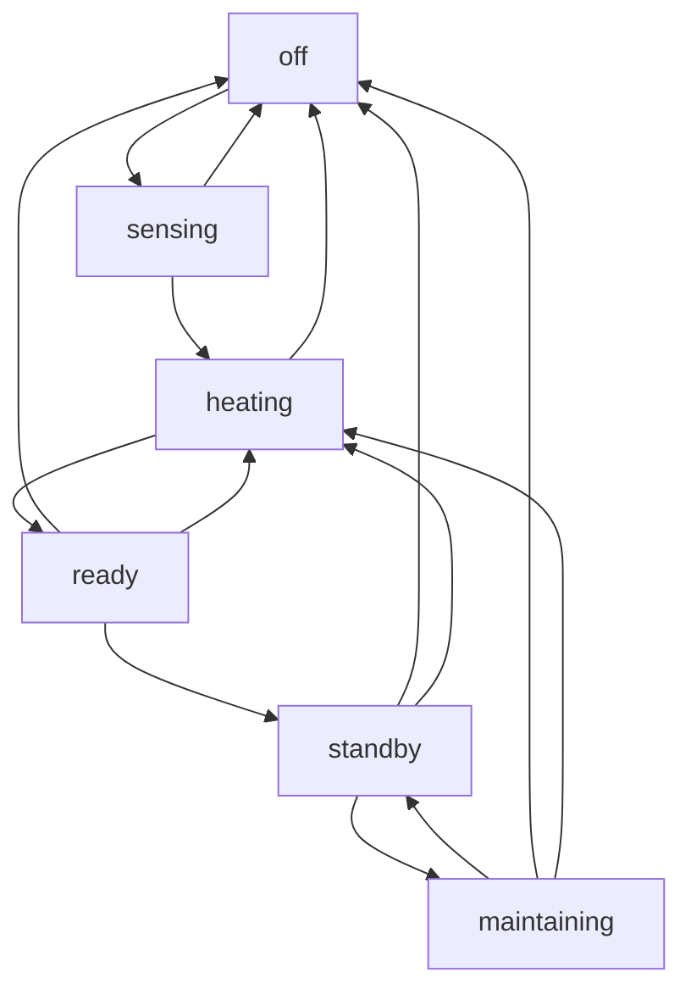

# Pool ESP Integration

## Description
> **_Dad .. When will the Spa be ready? ??_**

The Pool ESP (Estimate to Set Point) Integration can answer that!

Pool ESP automatically discovers your Pentair Screenlogic Device and creates the ESP Entities. Utilizing Home Assistant historically recorded data, your Pool and Spa heating characteristics are analyzed to provide an estimate of when the Water Temperature will reach the desired Set Point. Of course, you'll need the Pentair Screenlogic hardware and Home Assistant Integration. Other Pool Integrations are on the horizon.

The HA Recorder purges data after 10 days, thus Pool ESP can only look back that far in time. The Recorder purge can be adjusted in your [configuration.yaml](#configuration-steps).

To provide more useful estimates, Pool ESP maintains heating characteristics in private storage for up to a year. This data is also purned to alieviate unbounded growth.

Two sensor entities are created by Pool ESP; one for the Pool and one for the Spa. These entities provide the [State of Operation](#states) and additional **Attributes**:

| Attribute      | Description |
| -------------- | ----------- |
| body           | "pool" or "spa" |
| status         | Off, Sensing, Learning, D-HH:MM, Ready, Standby, Maintaining |
| seconds        | The number of **Sensing** seconds remaining, or number of seconds until Ready |
| confidence_pct | Confidence Percentage; based on the accumulated heating data |

Pool ESP can also estimate your cost of heating based on the heater type (gas, electric), energy usage and cost you provide.

**NOTES:**
* D-HH:MM .. Days (omitted if 0), Hours and Minutes until the water will be ready.
* MM:SS .. Minutes and Seconds during Water Sensing
* Once sufficient heating characteristics are determined, Pool ESP can provide estimates when the heater is off as well ...

> **_How long <ins>would</ins> it take if I turned on the Spa now?_**

## Prerequisites
Pool ESP currently relies on data provided by the *Pentair Screenlogic Integration*. If you do not have a Pentair Screenlogic automation and the Screenlogic Integration installed .. Pool ESP will not work. 

## Installation via HACS

Look for "Pool ESP" and install

## Configuration steps
Pool ESP is Zero Config (well, other than optional heater type and energy usage and cost). The Integration automatically identifies your Pentair Screenlogic Device and adds it's own Sensor Entities.

For example, Pool ESP discovers Device "**Pentair: 11-22-33**" and creates sensors:
* sensor.pentair_11_22_33_pool_esp
* sensor.pentair_11_22_33_pool_heater_cost
* sensor.pentair_11_22_33_pool_heater_runtime
* sensor.pentair_11_22_33_spa_esp
* sensor.pentair_11_22_33_spa_heater_cost
* sensor.pentair_11_22_33_spa_heater_runtime

If no suitable Device is found, the Integration setup displays an error message.

### HA Recorder
You can adjust how long the HA Recorder maintains historical data by adding to your **configuration.yaml**:

```
  recorder:
   purge_keep_days: 30  # Adjust to your desired number of days
   auto_purge: true
   auto_repack: true
```

## How ESP learning works
Pool ESP relies on the Home Assistant Recorder to gather data. If you've recently heated your Pool (or Spa), ESP can instantly produce estimates. If there is no useful data yet, ESP is "Learning". When sufficient heating data is available ESP will calculate how long it'll take to reach your desired Set Point.

How much is "sufficient"?

Just a single heating session is all it takes. ESP provides a Confidence percentage (determined by the quality and quantity of data available). The Confidence could start low (6% with only that single data point) and gradually increase over time as more quality data becomes available.

Pool ESP looks at how long it takes the Pool or Spa to increase in temperature and determines a rate. It does this in 5 degree Air Temperature bins. Cooler air temperatures could result in longer rates than wamer air temperatures. This will be evident in the [ESP Rate Viewer](#esp-rate-viewer).

It's interesting to note: the larger Pool volume is more affected by Air Temperature than a small Spa. This actually makes sense as there is more surface area.

## Watchdog
Once Pool ESP understands the heating characteristics it can alert if the heating time exceeds expectations. This FYI notification could be a natural event, such a very cold day, or indicate there is a heater malfunction which needs investigation.

## States
Pool ESP sensor entities provide the State of Operation:

| Entity State  | Description | Status Attribute |
| ------------- | ----------- | ---------------- |
| off         | Water is not being heated | Learning or D-HH:MM |
| sensing     | Heating; 2 minute delay, waiting for the Water Temperature to stabilize | Sensing |
| heating     | Activly heating the Water | Learning or D-HH:MM |
| ready       | Water Temperature has reached the Set Point | Ready |
| standby     | At Set Point, heating paused | Ready |
| maintaining | At Set Point, heating the Water to maintain temperature | Ready |

## State Machine

If you *really* want to know how it works ...



**NOTE:**
* State **ready** occurs only once. Perfect for an Automation to alert: "The Spa is ready".
* Increasing the water temperature <ins>after</ins> reaching Ready returns to heating, and will result in another Ready.
* States **standby** and **maintaining** alternate as the Heater turns on and off to keep the water at temperature.

## Sample Dashboard
In this example, the Spa Circuit is off, Heater enabled but not heating. Water is 98°, set to 99°. The ESP State is off (because the Circuit is off) and estimating that if it were turned on, it would take about 5 minutes to heat up.


## ESP Rate Viewer
The Pool ESP settings (gear icon) has an option to add the Rate Viewer into the Home Assistant Dashboard Sidebar. Pool ESP algorithmically prunes "bad data" over time and the Viewer allows you to proactivly delete extraneous values.

### First Time
The first time running the ESP Rate Viewer you'll need to provide your Long-lived Access Token.

1. Go to your Home Assistant Profile
2. Security Tab
3. Scroll to the bottom and create your Token
4. Copy and paste the value into the ESP Rate Viewer Settings field and click Connect
   - Recommend that you save this token somewhere


### Extraneous Values?
If your heater malfunctions (ie, heat pump fails to start a few times before functioning) _Screenlogic thinks it is heating_ but the heater hasn't started properly, which can cause the rate estimate to be exaggerated. These bogus values will age out over time, or can be manually removed.

Click on the Air Temperature bin to open the list of data rates. Check the rates you wish to delete, Click the [Delete Selected] button, then Click [Save to HA]

Select a range of rates with shift-click


